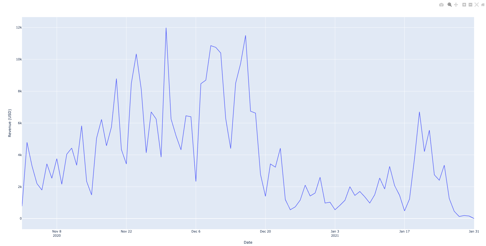

# analytics-ai-agent-demo

Demo of using AI Agents to query ecommerce data with pydantic-ai and bigquery

## Prerequisites

1. Log into GCP and ensure you are able to see and use Google's public dataset: https://cloud.google.com/bigquery/public-data/
2. Make sure you have access to that project from your cli: `gcloud auth application-default login`
3. `export OPENAI_API_KEY=sk-xxxxx`

## Usage

### Simple Demo

`uv run simple-memory/main.py`

```sh
User: Hi!
AI: Hello! How can I assist you today?

User: What is 2+2?
AI: 2 + 2 equals 4.

User: Add 5 to that.
AI: 4 plus 5 equals 9.
```

### BigQuery

`uv run bigquery/main.py`

You'll then see a lot of output like this:

```bash
----------------------------------------------------------------------------------------------------
Q: Run a query to find out what time period do you have data for?
A: The data is available for the following time period:

- **First Event Time:** October 31, 2020
- **Last Event Time:** February 1, 2021
----------------------------------------------------------------------------------------------------
Q: What was the total revenue generated in November 2020?
A: The total revenue generated in November 2020 was $144,260.00.
----------------------------------------------------------------------------------------------------
Q: How many sales (by count) were made in November 2020?
A: In November 2020, there were a total of 2,054 sales made.
----------------------------------------------------------------------------------------------------
Q: Which month had the highest revenue?
A: The month with the highest revenue was December 2020, with a total revenue of $160,555.00.
----------------------------------------------------------------------------------------------------
Q: Which traffic source provided the highest revenue overall?
A: The traffic source that provided the highest revenue overall is **Google**, with a total revenue of **$104,831.00**.
----------------------------------------------------------------------------------------------------
Q: Stratify the revenue in December 2020 by traffic source, then compare that to November 2020.
A: Here is the stratified revenue by traffic source for December 2020 and November 2020:

### December 2020 Revenue by Traffic Source
1. **Google**: $46,363
2. **(Direct)**: $36,233
3. **<Other>**: $35,029
4. **(Data Deleted)**: $22,086
5. **shop.googlemerchandisestore.com**: $20,844

### November 2020 Revenue by Traffic Source
1. **Google**: $40,597
2. **<Other>**: $33,055
3. **(Direct)**: $31,133
4. **(Data Deleted)**: $21,826
5. **shop.googlemerchandisestore.com**: $17,649

### Comparison
- The traffic source "Google" saw an increase in revenue from November to December, rising from $40,597 to $46,363.
- The "(Direct)" traffic source also increased from $31,133 in November to $36,233 in December.
- The "<Other>" category showed a small increase from $33,055 to $35,029.
- The "(Data Deleted)" traffic source remained relatively stable, with a slight increase from $21,826 to $22,086.
- Conversely, "shop.googlemerchandisestore.com" increased from $17,649 to $20,844.

Overall, December 2020 saw stronger revenue across most traffic sources compared to November 2020.
----------------------------------------------------------------------------------------------------
Q: Plot the revenue for each day for all the data you have access to.
A: The revenue for each day has been successfully plotted. You can see the daily revenue trends over the specified period. If you have any further questions or need additional insights, feel free to ask!
----------------------------------------------------------------------------------------------------
```


